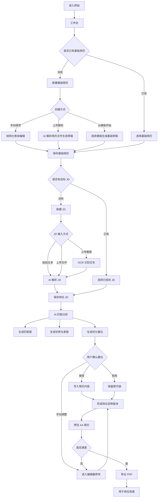

# AI Resume Builder 产品需求文档

## 1. 文档信息

| 项目 | 内容 |
| --- | --- |
| 产品名称 | AI Resume Builder |
| 产品定位 | 面向中文求职者的 AI 简历制作、岗位匹配与 PDF 导出工具 |
| 当前阶段 | 已上线 MVP |
| 文档目的 | 基于已完成作品反推产品需求，沉淀产品经理视角的目标、范围、功能、流程与验收标准 |
| 目标读者 | 产品经理、开发者、设计者、面试官、项目评审者 |

## 2. 产品背景

中文求职者在制作简历时通常会遇到三个问题：

1. 不知道如何把个人经历结构化表达成适合投递的简历内容。
2. 面对不同 JD 时，难以判断简历与岗位要求是否匹配。
3. 简历排版、模板选择、PDF 导出等流程分散，影响制作效率。

AI Resume Builder 希望把“简历内容整理、岗位需求理解、AI 优化建议、简历排版导出”放进一个连续工作流中。用户既可以从空白简历开始填写，也可以上传已有文件生成草稿，再围绕目标 JD 生成匹配分析和可确认的优化建议。

## 3. 产品目标

### 3.1 用户目标

- 快速创建一份结构清晰、适合中文投递场景的简历。
- 能针对目标岗位 JD 理解自己的优势、差距和需要补强的关键词。
- 能在不失去编辑权的前提下使用 AI 建议，而不是让 AI 直接替用户改写全部内容。
- 能预览 A4 简历效果，并通过浏览器导出 PDF。

### 3.2 业务/项目目标

- 展示一个完整的从需求、设计、开发到上线的产品闭环。
- 作为个人简历项目，体现产品思维、AI 应用能力、前端工程能力和上线部署能力。
- 形成可继续迭代的简历工具原型。

## 4. 目标用户

| 用户类型 | 典型特征 | 核心诉求 |
| --- | --- | --- |
| 应届生 / 实习生 | 经历较零散，不熟悉简历表达 | 需要模板、结构提示和经历包装建议 |
| 社招求职者 | 有多段工作或项目经历 | 需要按不同岗位定制简历版本 |
| 产品/运营/职能类候选人 | 需要突出项目、指标和岗位匹配度 | 需要 JD 拆解和关键词补强 |
| 项目评审者 / 面试官 | 关注作品完整度 | 需要看到产品流程、技术实现和上线成果 |

## 5. 核心场景

### 场景一：从零创建简历

用户进入网站后，选择新建简历，填写基础信息、教育经历、项目经历、工作/实习经历、技能、奖项等模块，选择模板和排版参数，最后预览并导出 PDF。

### 场景二：上传已有简历生成草稿

用户上传 JSON、TXT、MD、PDF 或 Word 文件，系统读取内容并调用 AI 结构化解析，生成可编辑的简历草稿，用户再继续编辑和排版。

### 场景三：围绕 JD 优化简历

用户粘贴或上传岗位 JD，系统解析岗位职责、任职要求、加分项和关键词。用户进入 AI 匹配分析页，选择一份简历生成匹配度、优势、差距、关键词覆盖和优化建议，并决定接受或拒绝建议。

### 场景四：作为作品展示产品能力

访问者可以通过首页、工作台、简历编辑器、JD 解析、AI 分析、PDF 导出等路径，看到一个已上线、可操作、具备完整产品链路的项目。

## 6. 产品范围

### 6.1 当前版本包含

- 以“基础简历 -> 岗位 JD -> 岗位定制版本”为核心的任务中枢。
- 基础简历创建：手动填写、上传解析、使用示例、从模板开始。
- 基础简历管理：查看、编辑、删除、进入 JD 解析、查看版本入口。
- 结构化简历编辑器：基础信息、教育、工作/实习、项目、校园、技能、奖项、证书、自定义经历。
- 简历模板与排版设置：模板选择、A4 实时预览、字体、字号、行距、页边距、照片位置、颜色等。
- 岗位 JD 管理：空状态引导、已保存 JD 列表、编辑 JD、进入匹配分析。
- JD 输入与解析：文本粘贴、文件上传、截图 OCR、AI 解析、岗位信息提取。
- AI 匹配分析：简历与 JD 匹配度、关键词覆盖、优势差距、可确认优化建议。
- AI 建议处理：用户可接受或拒绝建议，接受后写入简历字段。
- 简历预览与导出：A4 预览、浏览器打印导出 PDF。
- 浏览器 localStorage 本地保存。
- Vercel 部署上线。

### 6.2 当前版本不包含

- 用户账号体系。
- 云端数据库与多设备同步。
- 在线支付、会员或模板商城。
- 多人协作编辑。
- 服务端文件永久存储。
- 简历投递渠道对接。
- 完整埋点分析后台。

## 7. 信息架构

当前版本的信息架构按用户任务组织，而不是按模板或单个页面组织。核心对象是：基础简历、岗位 JD、岗位定制版本。

### 7.1 工作台模块

工作台承担任务中枢角色，帮助用户理解下一步该做什么。

| 子模块 | 内容 | 目标 |
| --- | --- | --- |
| 最近使用 | 最近编辑的简历、最近解析的 JD、最近生成的定制版本 | 让用户快速回到上一次任务 |
| 快捷操作 | 新建基础简历、新建 JD、生成岗位版本 | 暴露核心工作流入口 |
| 我的资产 | 基础简历、我的岗位、定制版本简历数量与入口 | 帮助用户理解自己已沉淀的资产 |

对应页面：`/dashboard`

### 7.2 基础简历模块

基础简历是用户的完整经历库，用于沉淀通用信息，不一定直接用于某一次投递。

| 子模块 | 页面/路由 | 内容 |
| --- | --- | --- |
| 基础简历列表 | `/resumes` | 按“基础简历”和“岗位定制版本”分组展示 |
| 新建基础简历 | `/resumes/new` | 支持手动填写、上传解析、使用示例、从模板开始 |
| 简历编辑器 | `/resumes/[resumeId]/edit` | 结构化编辑、模块排序、排版设置、实时 A4 预览 |
| 简历预览 | `/resumes/[resumeId]/preview` | 查看 A4 效果并导出 PDF |
| 简历版本入口 | `/resumes/[resumeId]/versions` | 查看某份基础简历关联的岗位版本 |

基础简历列表的主要操作：

- 编辑基础简历。
- 创建岗位版本。
- 查看版本。
- 删除简历。

### 7.3 岗位 JD 模块

岗位 JD 是定制简历的输入源。用户可以把招聘信息粘贴或上传到系统，由系统提取结构化信息。

| 子模块 | 页面/路由 | 内容 |
| --- | --- | --- |
| 我的岗位 | `/jds` | 查看已保存 JD；空状态解释 JD 的价值和下一步动作 |
| JD 输入与解析 | `/resumes/[resumeId]/jd` | 粘贴 JD、上传文本文件、上传截图 OCR、AI 解析 |
| 岗位信息展示 | `/resumes/[resumeId]/jd` | 展示职位、公司、地点、薪资、职责、要求、加分项、关键词 |

岗位页空状态需要明确告诉用户：系统会自动提取岗位名称、公司、地点、薪资、岗位职责、任职要求和关键词，并用于后续 AI 匹配。

### 7.4 岗位定制版本模块

岗位定制版本是从基础简历出发，围绕某个 JD 进行筛选、排序和改写后的投递版本。

| 子模块 | 页面/路由 | 内容 |
| --- | --- | --- |
| 定制版本列表 | `/resumes` | 在“岗位定制版本”分组中展示 |
| 版本管理入口 | `/resumes/[resumeId]/versions` | 查看某份基础简历下的版本 |
| 版本编辑 | `/resumes/[resumeId]/edit` | 编辑定制版本内容和排版 |
| 版本预览导出 | `/resumes/[resumeId]/preview` | 预览并导出面向岗位的 PDF |

当前阶段先在页面层面建立“基础简历 / 岗位版本”的认知；完整的版本复制、关联和恢复能力作为后续迭代。

### 7.5 AI 匹配与优化模块

AI 模块连接基础简历和岗位 JD，输出匹配分析与可确认建议。

| 子模块 | 页面/路由 | 内容 |
| --- | --- | --- |
| AI 匹配分析 | `/resumes/[resumeId]/ai-review` | 总体匹配度、关键词覆盖、JD 解析置信度 |
| 优势与差距 | `/resumes/[resumeId]/ai-review` | 展示简历相对 JD 的优势和待补足项 |
| 优化建议 | `/resumes/[resumeId]/ai-review` | 用户可接受或拒绝建议，接受后写入简历 |

设计原则：AI 只提供建议和结构化修改，用户保留最终编辑权。

### 7.6 产品流程图

产品主流程围绕“基础简历 -> 岗位 JD -> AI 匹配 -> 岗位定制版本 -> PDF 投递”展开。



简化后的用户心智：

```text
维护一份基础简历 -> 解析一个目标岗位 -> 生成一份岗位定制版本 -> 预览导出 PDF
```

### 7.7 系统与 API 模块

| 子模块 | 页面/路由 | 内容 |
| --- | --- | --- |
| 首页 | `/` | 产品介绍、核心能力、工作台入口 |
| 健康检查 | `/api/health` | API 可用性检查 |
| AI API | `/api/ai/*` | 简历解析、JD 解析、匹配分析、经历润色 |

## 8. 核心功能需求

### 8.1 简历创建

| 编号 | 需求 | 优先级 | 验收标准 |
| --- | --- | --- | --- |
| FR-001 | 用户可以手动创建空白简历 | P0 | 点击“新建简历”后进入编辑器，并生成本地草稿 |
| FR-002 | 用户可以使用示例简历 | P0 | 点击示例后生成可编辑简历 |
| FR-003 | 用户可以上传简历文件生成草稿 | P0 | 支持 JSON/TXT/MD/PDF/DOC/DOCX，成功后进入编辑器 |
| FR-004 | 非 JSON 文件优先使用 AI 结构化解析 | P1 | AI 失败时回退到基础文本解析，不阻断用户使用 |

### 8.2 简历编辑器

| 编号 | 需求 | 优先级 | 验收标准 |
| --- | --- | --- | --- |
| FR-005 | 用户可以编辑基础信息 | P0 | 支持姓名、职位、电话、邮箱、地点、网站、政治面貌等字段 |
| FR-006 | 用户可以编辑经历类模块 | P0 | 支持教育、工作、实习、项目、校园、其他经历 |
| FR-007 | 用户可以编辑列表类模块 | P0 | 支持技能、奖项、证书 |
| FR-008 | 用户可以新增自定义经历模块 | P1 | 新模块可填写标题与经历内容，并出现在预览中 |
| FR-009 | 用户可以调整模块顺序 | P1 | 调整后预览顺序同步变化 |
| FR-010 | 用户可以删除不需要的模块 | P1 | 删除后模块内容清空，预览不再展示 |
| FR-011 | 用户可以保存草稿到本地 | P0 | 刷新页面或重新进入后仍能读取保存内容 |

### 8.3 模板与排版

| 编号 | 需求 | 优先级 | 验收标准 |
| --- | --- | --- | --- |
| FR-012 | 用户可以选择不同简历模板 | P0 | 模板切换后预览样式同步变化 |
| FR-013 | 用户可以调整字体和字号 | P0 | 姓名、联系方式、标题、正文可分别调整字号 |
| FR-014 | 用户可以调整行距、页边距和内容位置 | P0 | 调整后 A4 预览即时更新 |
| FR-015 | 用户可以调整正文色、标题色和标题粗细 | P1 | 视觉设置可保存到简历主题中 |
| FR-016 | 用户可以调整照片大小和位置 | P1 | 上传照片后可控制展示位置和尺寸 |

### 8.4 预览与导出

| 编号 | 需求 | 优先级 | 验收标准 |
| --- | --- | --- | --- |
| FR-017 | 系统提供 A4 简历预览 | P0 | 编辑页和预览页均能看到 A4 效果 |
| FR-018 | 用户可以导出 PDF | P0 | 点击导出后打开浏览器打印面板，用户可另存为 PDF |

### 8.5 JD 解析

| 编号 | 需求 | 优先级 | 验收标准 |
| --- | --- | --- | --- |
| FR-019 | 用户可以粘贴 JD 文本 | P0 | 输入后可触发解析 |
| FR-020 | 用户可以上传 JD 文本文件 | P0 | 支持 TXT/MD/JSON 并解析出岗位信息 |
| FR-021 | 用户可以上传 JD 截图 OCR | P1 | 支持 PNG/JPG/JPEG/WEBP/BMP，识别后进入 AI 解析 |
| FR-022 | 系统提取岗位基础信息 | P0 | 展示职位、公司、地点、薪资、职责、要求、加分项 |
| FR-023 | 系统提取关键词和岗位解读 | P0 | 展示关键词、核心技能、看重能力、简历润色方向 |

### 8.6 AI 匹配分析

| 编号 | 需求 | 优先级 | 验收标准 |
| --- | --- | --- | --- |
| FR-024 | 用户可以选择一份简历与当前 JD 进行匹配 | P0 | 下拉选择不同简历后可重新分析 |
| FR-025 | 系统生成匹配度指标 | P0 | 展示总体匹配度、关键词覆盖、JD 解析置信度 |
| FR-026 | 系统生成优势与差距分析 | P0 | 展示简历相对 JD 的优势和待补足点 |
| FR-027 | 系统生成可确认的优化建议 | P0 | 每条建议包含原因、目标路径、建议内容和状态 |
| FR-028 | 用户可以接受或拒绝 AI 建议 | P0 | 接受后写入简历对应字段，拒绝后仅更新建议状态 |

## 9. 数据需求

### 9.1 简历数据

简历数据包含：

- 基础信息：姓名、职位、电话、邮箱、地点、网站、照片等。
- 经历信息：教育、工作、实习、项目、校园、其他经历。
- 列表信息：技能、奖项、证书。
- 自定义模块：模块标题与经历条目。
- 主题信息：模板、字体、字号、行距、页边距、颜色、照片设置等。
- 元信息：ID、名称、来源、更新时间。

### 9.2 JD 数据

JD 数据包含：

- 原始文本。
- 来源：文本、文件、图片。
- 职位、公司、地点、薪资。
- 职责、要求、加分项。
- 关键词。
- 解析置信度。
- 岗位解读：角色摘要、核心技能、看重能力、简历润色方向。

### 9.3 存储策略

当前 MVP 使用浏览器 localStorage 存储简历与 JD 数据。优点是实现简单、无需登录、适合单人演示；限制是不同浏览器和设备之间无法同步，清除浏览器数据后会丢失草稿。

## 10. AI 能力需求

| 能力 | 输入 | 输出 | 失败处理 |
| --- | --- | --- | --- |
| 简历解析 | 简历文件文本 | 结构化 ResumeData | 回退到基础文本解析 |
| JD 解析 | JD 原文 | 结构化 JobDescriptionData | 回退到规则解析 |
| 匹配分析 | ResumeData + JobDescriptionData | 匹配分、优势、差距、建议 | 展示错误提示，不改写简历 |
| 经历润色 | 单条经历 + JD 上下文 | 建议文案 | 用户确认后才应用 |

AI 设计原则：

- AI 提供建议，用户保留最终编辑权。
- AI 输出需要结构化，便于写入具体字段。
- AI 失败不应阻断核心编辑流程。
- API Key 仅保存在服务端环境变量中，不暴露到前端。

## 11. 非功能需求

| 类型 | 要求 |
| --- | --- |
| 可用性 | 核心路径不依赖登录；AI 失败时仍可手动编辑 |
| 响应速度 | 本地编辑和预览应即时反馈；AI 请求需展示加载状态 |
| 兼容性 | 支持主流桌面浏览器；移动端可访问但以桌面编辑体验为主 |
| 安全性 | 不提交 `.env.local`；API Key 不进入前端代码 |
| 可维护性 | 使用 TypeScript 类型约束简历、JD 和 AI 返回结构 |
| 可部署性 | 支持 Vercel 部署，构建命令为 `npm run build` |

## 12. 关键用户流程

### 12.1 新建基础简历并导出

```text
进入首页 -> 工作台 -> 新建基础简历 -> 选择手动/上传/模板 -> 编辑完整经历 -> 调整排版 -> 保存 -> 预览 -> 导出 PDF
```

### 12.2 上传简历并优化

```text
进入新建简历 -> 上传文件 -> AI 解析生成草稿 -> 编辑确认 -> 保存 -> 预览
```

### 12.3 基于 JD 生成岗位定制版本

```text
工作台 -> 新建 JD -> 粘贴/上传 JD -> AI 解析 -> 保存 JD -> AI 匹配分析 -> 查看优势和差距 -> 接受/拒绝建议 -> 回到编辑器确认 -> 预览导出岗位版本
```

## 13. 成功指标

当前版本以作品展示和可用性验证为主，可使用以下指标衡量：

| 指标 | 含义 |
| --- | --- |
| 简历创建完成率 | 进入新建页后成功生成简历草稿的比例 |
| 简历导出完成率 | 创建简历后进入预览并触发导出 PDF 的比例 |
| JD 解析完成率 | 输入或上传 JD 后成功生成结构化结果的比例 |
| AI 建议采纳率 | 生成的建议中被用户接受的比例 |
| 核心路径完成时间 | 从进入网站到导出第一份简历所需时间 |
| 项目展示转化 | 访问者能否理解项目目标、能力边界和上线结果 |

## 14. MVP 验收标准

当前版本可视为 MVP 完成，当且仅当：

1. 用户可以创建、编辑、保存并重新打开至少一份简历。
2. 用户可以从上传文件生成简历草稿。
3. 用户可以选择模板并调整基础排版。
4. 用户可以在 A4 页面中预览简历。
5. 用户可以通过浏览器导出 PDF。
6. 用户可以粘贴或上传 JD，并得到结构化解析结果。
7. 用户可以生成简历与 JD 的 AI 匹配分析。
8. 用户可以接受或拒绝 AI 建议，接受后写入简历。
9. 网站可以在线访问，且核心页面可正常加载。

## 15. 已知限制与风险

| 风险 | 影响 | 后续方向 |
| --- | --- | --- |
| localStorage 数据不可跨设备同步 | 用户换设备后看不到草稿 | 引入账号和云端数据库 |
| 浏览器打印导出 PDF 可控性有限 | 不同浏览器导出效果可能有差异 | 接入服务端 PDF 渲染 |
| AI 输出稳定性受模型影响 | 解析结果可能不准确 | 增加校验、重试和用户编辑确认 |
| OCR 识别依赖图片质量 | 截图模糊时解析效果差 | 增加图片质量提示和手动修正入口 |
| 缺少真实用户数据 | 难以判断模板和建议质量 | 增加埋点和用户反馈收集 |

## 16. 后续迭代方向

### V1.1 体验增强

- 增加简历一页适配提示。
- 增加模板筛选、收藏和最近使用。
- 增加 AI 建议编辑后再应用。
- 增加简历内容缺失检查。

### V1.2 数据与账号

- 增加登录能力。
- 接入数据库，实现多设备同步。
- 支持简历版本复制、命名和恢复。
- 支持导入/导出项目数据。

### V1.3 产品化能力

- 增加用户行为埋点。
- 增加反馈入口。
- 增加岗位库和 JD 历史管理。
- 增加简历投递记录。
- 增加面向不同岗位的简历版本推荐。

## 17. 一句话总结

AI Resume Builder 的核心价值是：让求职者围绕目标岗位，高效完成“简历结构化整理 -> JD 理解 -> AI 匹配建议 -> 人工确认优化 -> PDF 投递”的完整闭环。
