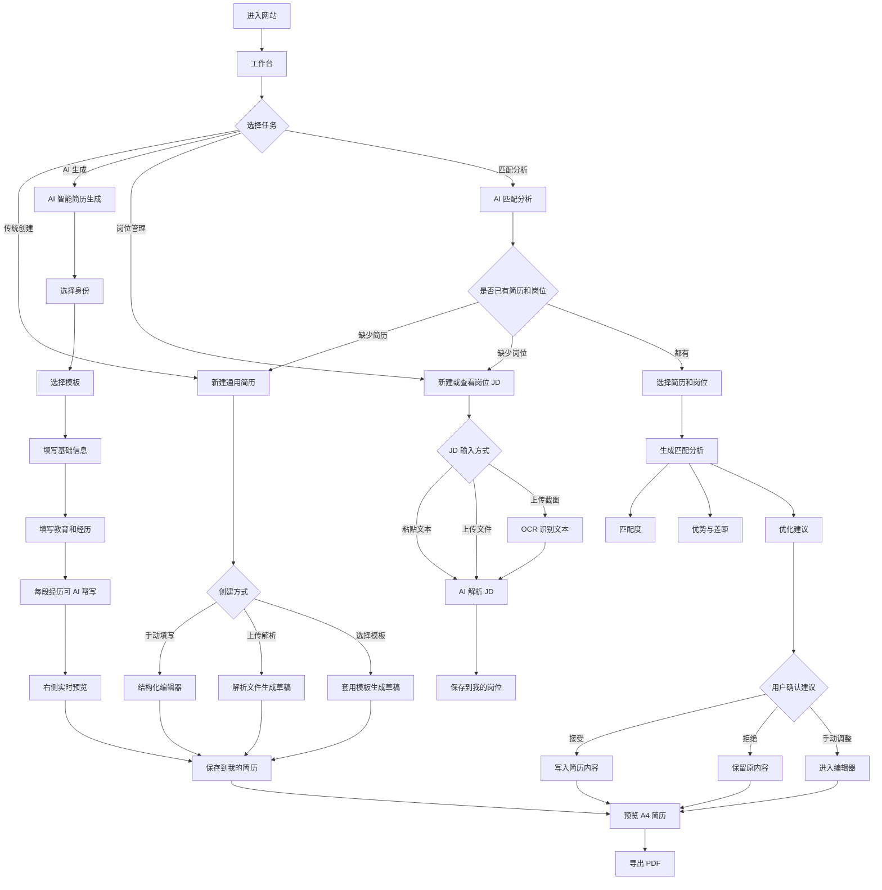

# AI Resume Builder 产品需求文档

## 1. 文档信息

| 项目 | 内容 |
| --- | --- |
| 产品名称 | AI Resume Builder |
| 产品定位 | 面向中文求职者的 AI 简历生成、JD 解析与岗位匹配工具 |
| 当前阶段 | 已上线 MVP |
| 文档目的 | 基于已完成网站反推产品需求，沉淀产品目标、模块范围、用户流程和验收标准 |
| 目标读者 | 产品经理、开发者、设计者、面试官、项目评审者 |

## 2. 产品背景

中文求职者在制作简历时常见问题包括：

1. 不知道如何把经历整理成适合投递的简历表达。
2. 已经有经历素材，但缺少结构化组织和专业化表述。
3. 面对不同岗位 JD 时，难以判断简历和岗位要求是否匹配。
4. 简历编辑、岗位分析、AI 建议和 PDF 导出分散在不同工具中。

AI Resume Builder 希望把简历创建、AI 生成、岗位 JD 解析、匹配分析和 PDF 导出放进一个连续流程中，让用户可以快速得到一份可编辑、可优化、可投递的简历。

## 3. 产品目标

### 3.1 用户目标

- 能通过传统方式创建一份通用简历。
- 能通过 AI 对话式流程生成一份简历初稿。
- 能保存并管理所有简历草稿。
- 能保存岗位 JD，并理解岗位职责、要求和关键词。
- 能选择简历和岗位进行 AI 匹配分析。
- 能在接受 AI 建议前保留最终编辑权。
- 能预览 A4 简历并导出 PDF。

### 3.2 项目目标

- 展示从产品思考、功能设计、工程实现到部署上线的完整闭环。
- 作为个人作品，体现 AI 产品设计能力、前端开发能力和上线部署能力。
- 形成一个可继续迭代的 AI 求职工具原型。

## 4. 目标用户

| 用户类型 | 典型特征 | 核心诉求 |
| --- | --- | --- |
| 应届生 / 实习生 | 经历较散，不熟悉简历表达 | 需要模板、结构提示和 AI 帮写 |
| 社招求职者 | 有工作和项目经历 | 需要管理多份简历并针对岗位优化 |
| 产品/运营/职能候选人 | 需要突出项目、指标和岗位匹配 | 需要 JD 拆解和关键词建议 |
| 项目评审者 / 面试官 | 关注作品完整度 | 需要看到清晰产品流程和上线成果 |

## 5. 产品范围

### 5.1 当前版本包含

- 工作台：我的简历、我的岗位、AI 匹配分析三大入口。
- 新建通用简历：手动填写、上传解析、从模板开始、使用示例。
- AI 智能简历生成：对话式分步采集信息、默认模板预览、每段经历 AI 帮写、保存草稿。
- 我的简历：展示所有保存简历，支持编辑、重命名、删除。
- 简历编辑器：结构化编辑、模块排序、排版调整、实时预览。
- JD 解析：粘贴文本、上传文件、上传截图 OCR、AI 提取岗位信息。
- 我的岗位：展示已保存 JD，支持编辑和进入匹配分析。
- AI 匹配分析：选择简历和岗位，生成匹配度、优势、差距和优化建议。
- 预览导出：A4 页面预览和浏览器打印导出 PDF。
- 本地存储：使用浏览器 `localStorage` 保存简历和 JD。
- Vercel 部署上线。

### 5.2 当前版本不包含

- 用户账号体系。
- 云端数据库和多设备同步。
- 简历投递渠道对接。
- 在线支付、会员或模板商城。
- 多人协作编辑。
- 服务端文件永久存储。
- 完整数据埋点后台。

## 6. 信息架构

当前信息架构按用户任务组织，而不是按底层数据对象组织。用户进入工作台后，可以从“创建简历、管理岗位、做匹配分析”三个方向开始。

### 6.1 工作台

对应路由：`/dashboard`

| 模块 | 子入口 | 说明 |
| --- | --- | --- |
| 我的简历 | 新建通用简历 | 传统创建方式，支持手动、上传、模板、示例 |
| 我的简历 | AI 智能简历生成 | 对话式收集信息，由 AI 生成简历初稿 |
| 我的简历 | 我的简历 | 查看所有保存简历，支持编辑、重命名、删除 |
| 我的岗位 | 新建岗位 JD | 粘贴或上传岗位信息并解析 |
| 我的岗位 | 我的岗位 JD | 查看已保存岗位 JD |
| AI 匹配分析 | 开始匹配分析 | 选择一份简历和一个岗位 JD 进行分析 |

### 6.2 我的简历模块

| 页面 | 路由 | 功能 |
| --- | --- | --- |
| 新建简历 | `/resumes/new` | 手动创建、上传解析、使用示例、从模板开始 |
| AI 智能生成 | `/resumes/ai-generate` | 分步对话式生成简历 |
| 我的简历 | `/resumes` | 所有保存简历列表，支持编辑、重命名、删除 |
| 简历编辑器 | `/resumes/[resumeId]/edit` | 结构化编辑、排版调整、实时预览 |
| 简历预览 | `/resumes/[resumeId]/preview` | A4 预览和 PDF 导出 |

我的简历列表不再区分通用、定制或来源类型，而是作为用户的简历文件夹统一管理。

### 6.3 我的岗位模块

| 页面 | 路由 | 功能 |
| --- | --- | --- |
| 我的岗位 | `/jds` | 查看已保存岗位 JD；空状态引导新建 JD |
| JD 输入与解析 | `/resumes/[resumeId]/jd` | 粘贴 JD、上传文件、上传截图 OCR、AI 解析 |
| 岗位信息展示 | `/resumes/[resumeId]/jd` | 展示职位、公司、地点、薪资、职责、要求、加分项、关键词 |

### 6.4 AI 匹配分析模块

| 页面 | 路由 | 功能 |
| --- | --- | --- |
| 匹配入口 | `/ai-match` | 选择简历和岗位 JD；缺少数据时给出引导 |
| 分析结果 | `/resumes/[resumeId]/ai-review` | 展示匹配度、关键词覆盖、优势、差距、优化建议 |

## 7. 产品流程图



简化心智：

```text
创建或生成简历 -> 保存岗位 JD -> 选择简历和岗位做 AI 匹配 -> 编辑确认 -> 预览导出
```

## 8. 核心功能需求

### 8.1 工作台

| 编号 | 需求 | 优先级 | 验收标准 |
| --- | --- | --- | --- |
| FR-001 | 工作台展示三大模块 | P0 | 用户能看到“我的简历 / 我的岗位 / AI 匹配分析” |
| FR-002 | 工作台提供核心入口 | P0 | 可进入新建简历、AI 生成、我的简历、新建 JD、我的岗位、AI 匹配 |

### 8.2 新建通用简历

| 编号 | 需求 | 优先级 | 验收标准 |
| --- | --- | --- | --- |
| FR-003 | 用户可手动创建简历 | P0 | 点击后进入编辑器并生成草稿 |
| FR-004 | 用户可上传文件解析简历 | P0 | 支持 JSON/TXT/MD/PDF/DOC/DOCX |
| FR-005 | 用户可从模板开始 | P1 | 选择模板后进入编辑器 |
| FR-006 | 用户可使用示例简历 | P1 | 示例保存后可编辑 |

### 8.3 AI 智能简历生成

| 编号 | 需求 | 优先级 | 验收标准 |
| --- | --- | --- | --- |
| FR-007 | 页面采用对话式分步流程 | P0 | 每完成一步，上方显示用户回答记录 |
| FR-008 | 目标岗位可选 | P0 | 不填写目标岗位也可生成通用简历 |
| FR-009 | 右侧固定展示模板预览 | P0 | 左侧滚动时右侧预览仍可见 |
| FR-010 | 用户可选择模板 | P0 | 切换模板后预览版式明显变化 |
| FR-011 | 经历按模块填写 | P0 | 支持工作、实习、项目、校园、其他经历 |
| FR-012 | 每段经历可 AI 帮写 | P0 | 点击后将自然语言素材改写为简历表达 |
| FR-013 | 用户可保存或进入编辑器 | P0 | 支持直接保存、保存并进入编辑器 |

### 8.4 我的简历

| 编号 | 需求 | 优先级 | 验收标准 |
| --- | --- | --- | --- |
| FR-014 | 展示所有已保存简历 | P0 | 不按来源或类型分组 |
| FR-015 | 用户可编辑简历 | P0 | 点击编辑进入对应编辑器 |
| FR-016 | 用户可重命名简历 | P0 | 输入新名称后列表更新 |
| FR-017 | 用户可删除简历 | P0 | 删除前确认，删除后列表移除 |

### 8.5 JD 解析与岗位管理

| 编号 | 需求 | 优先级 | 验收标准 |
| --- | --- | --- | --- |
| FR-018 | 用户可新建岗位 JD | P0 | 可从工作台或岗位页进入 |
| FR-019 | 用户可粘贴或上传 JD | P0 | 支持文本、文件和截图 OCR |
| FR-020 | 系统提取岗位信息 | P0 | 展示职位、公司、地点、薪资、职责、要求、关键词 |
| FR-021 | 用户可查看已保存岗位 | P0 | `/jds` 展示岗位列表 |

### 8.6 AI 匹配分析

| 编号 | 需求 | 优先级 | 验收标准 |
| --- | --- | --- | --- |
| FR-022 | 用户可选择简历和岗位 | P0 | `/ai-match` 提供两个选择器 |
| FR-023 | 缺少数据时给出引导 | P0 | 没有简历或 JD 时提示先创建 |
| FR-024 | 系统生成匹配分析 | P0 | 展示匹配度、关键词覆盖、优势、差距 |
| FR-025 | 系统生成优化建议 | P0 | 建议可接受或拒绝 |
| FR-026 | 用户保留最终编辑权 | P0 | AI 建议不会绕过用户确认直接覆盖内容 |

### 8.7 预览与导出

| 编号 | 需求 | 优先级 | 验收标准 |
| --- | --- | --- | --- |
| FR-027 | 用户可预览 A4 简历 | P0 | 编辑页和预览页可查看 A4 效果 |
| FR-028 | 用户可导出 PDF | P0 | 通过浏览器打印另存为 PDF |

## 9. 数据需求

### 9.1 简历数据

简历数据包含：

- 基础信息：姓名、职位、电话、邮箱、地点、网站、照片等。
- 内容模块：教育、工作、实习、项目、校园、其他经历、技能、证书、奖项。
- 自定义模块。
- 主题信息：模板、字体、字号、行距、页边距、颜色、照片设置。
- 元信息：ID、名称、来源、更新时间。

### 9.2 JD 数据

JD 数据包含：

- 原始文本。
- 来源：文本、文件、图片。
- 职位、公司、地点、薪资。
- 职责、要求、加分项。
- 关键词。
- 解析置信度。
- 岗位解读。

### 9.3 存储策略

当前 MVP 使用浏览器 `localStorage`：

- 优点：无需登录、实现简单、适合演示。
- 限制：不能跨设备同步，清除浏览器数据后会丢失。

## 10. 非功能需求

| 类型 | 要求 |
| --- | --- |
| 可用性 | AI 失败时仍可手动编辑 |
| 响应速度 | 本地编辑和预览即时反馈 |
| 兼容性 | 以桌面浏览器体验为主 |
| 安全性 | API Key 不进入前端代码，不提交 `.env.local` |
| 可维护性 | 使用 TypeScript 类型约束核心数据 |
| 可部署性 | 支持 Vercel 部署 |

## 11. 成功指标

| 指标 | 含义 |
| --- | --- |
| 简历创建完成率 | 进入创建流程后成功保存简历的比例 |
| AI 生成完成率 | 进入 AI 生成页后完成保存的比例 |
| JD 解析完成率 | 输入 JD 后成功生成结构化结果的比例 |
| 匹配分析完成率 | 选择简历和岗位后成功生成分析的比例 |
| AI 建议采纳率 | 用户接受 AI 建议的比例 |
| PDF 导出完成率 | 用户预览并导出 PDF 的比例 |

## 12. MVP 验收标准

当前版本可视为 MVP 完成，当且仅当：

1. 用户可以通过工作台进入主要功能。
2. 用户可以手动或上传创建简历。
3. 用户可以通过 AI 分步流程生成简历。
4. 用户可以管理所有已保存简历，包括编辑、重命名、删除。
5. 用户可以解析并保存岗位 JD。
6. 用户可以选择简历和岗位做 AI 匹配分析。
7. 用户可以接受或拒绝 AI 建议。
8. 用户可以预览 A4 简历并导出 PDF。
9. 网站可以在线访问，核心页面正常加载。

## 13. 已知限制与风险

| 风险 | 影响 | 后续方向 |
| --- | --- | --- |
| localStorage 不支持跨设备同步 | 换设备后看不到草稿 | 引入账号和云数据库 |
| AI 输出不稳定 | 建议可能不准确 | 增加校验、重试和编辑确认 |
| OCR 依赖图片质量 | 截图模糊时识别差 | 增加图片质量提示 |
| 浏览器打印导出可控性有限 | PDF 效果可能因浏览器不同而变化 | 接入服务端 PDF 渲染 |
| 缺少真实用户数据 | 难以评估生成质量 | 增加反馈和埋点 |

## 14. 后续迭代方向

### V1.1 体验增强

- AI 生成页接入真实模型生成，而不是本地规则改写。
- 支持多条经历逐条添加、排序和删除。
- AI 建议支持“编辑后应用”。
- 增加简历完整度检查。

### V1.2 数据与账号

- 增加登录。
- 接入数据库。
- 支持多设备同步。
- 支持云端文件导入和导出。

### V1.3 产品化能力

- 增加岗位库。
- 增加投递记录。
- 增加用户反馈入口。
- 增加行为数据分析。

## 15. 一句话总结

AI Resume Builder 的核心价值是：让求职者用更低成本完成“简历生成 -> 岗位理解 -> AI 匹配 -> 编辑确认 -> PDF 投递”的完整闭环。
